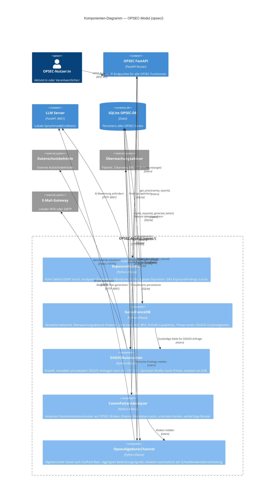

# C4-Modell Level 3 — Komponenten-Diagramm: OPSEC-Modul

## Übersicht

Das Komponenten-Diagramm zeigt die interne Struktur des OPSEC-Moduls (`opsec/`). Es enthält fünf Hauptklassen, die zusammen eine vollständige defensive Überwachungsgegeninfrastruktur bilden. Das Diagramm zeigt Abhängigkeiten zwischen Komponenten, Datenflüsse und externe Schnittstellen.

---

## Mermaid-Diagramm



---

## Komponenten-Beschreibungen

### 1. ExposureScanner

**Zweck**: Führt automatisierte Selbst-OSINT-Analysen durch. Scannt öffentlich zugängliche Datenquellen auf digitale Exposition einer Person oder Organisation.

**Kernfunktionen**:
- `scan_exposure(target: str) -> list[ExposureFinding]`: Vollständiger Scan
- `check_data_breaches(email: str) -> list[ExposureFinding]`: Datenleck-Prüfung
- `analyze_social_footprint(username: str) -> ExposureFinding`: Social-Media-Analyse
- `check_public_documents(name: str) -> list[ExposureFinding]`: Dokument-Recherche

**Datenfluss**:
```
Eingabe: Target (E-Mail, Name, Username, Domain)
→ Multi-Source-Scan
→ ExposureFinding-Liste
→ Persistierung in SQLite
→ Kritische Findings → OpsecAlgedonicChannel
→ KI-Bewertung via LLM Server
```

**Externe Schnittstellen**: Öffentliche OSINT-Quellen (read-only)

---

### 2. SurveillanceDB

**Zweck**: Wissensbank über bekannte Überwachungsakteure. Enthält strukturierte Informationen zu Palantir, Clearview AI, NSO Group, BfV, Meta, Google und weiteren.

**Kernfunktionen**:
- `get_actor(name: str) -> SurveillanceActor`: Einzelnen Akteur abrufen
- `search_actors(query: str) -> list[SurveillanceActor]`: Freitextsuche
- `get_by_threat_level(level: ThreatLevel) -> list[SurveillanceActor]`: Nach Bedrohung filtern
- `add_actor(actor: SurveillanceActor)`: Neuen Akteur hinzufügen
- `get_dsgvo_contact(actor_name: str) -> str`: DSGVO-Zuständige Stelle
- `update_capabilities(name: str, caps: list[str])`: Capabilities aktualisieren

**Datenstruktur**: Jeder Akteur hat Name, Typ (CORPORATE/STATE_INTELLIGENCE/LAW_ENFORCEMENT/MILITARY/DATA_BROKER), Capabilities, ThreatLevel (LOW/MEDIUM/HIGH/CRITICAL), DSGVO-Kontakt, bekannte Datenkategorien.

---

### 3. DSGVOAutomation

**Zweck**: Automatisiert den gesamten DSGVO-Anfrageprozess von der Erstellung bis zur Eskalation. Implementiert Art. 15 (Auskunft), Art. 17 (Löschung), Art. 21 (Widerspruch) DSGVO.

**Kernfunktionen**:
- `create_request(target, request_type, requester_data) -> DSGVORequest`: Neue Anfrage erstellen
- `generate_letter(request_id: str) -> str`: Rechtssicheres Anschreiben generieren
- `mark_sent(request_id: str)`: Als versendet markieren (Frist startet)
- `check_overdue() -> list[DSGVORequest]`: Überfällige Anfragen prüfen (30-Tage-Frist)
- `escalate_to_aufsicht(request_id: str)`: Eskalation an Datenschutzbehörde
- `get_status(request_id: str) -> RequestStatus`: Aktueller Status

**Fristen-Logik**:
- Anfrage erstellt → 30 Tage Wartefrist
- Nach 30 Tagen ohne Antwort → `check_overdue()` → automatische Eskalation verfügbar
- Eskalation → Beschwerde nach Art. 77 DSGVO an zuständige DSB

---

### 4. CommPatternAnalyzer

**Zweck**: Analysiert Kommunikationsmuster auf OPSEC-Risiken. Erkennt Metadaten-Lecks, unsichere Kommunikationskanäle, verdächtige Gesprächsmuster.

**Kernfunktionen**:
- `analyze_patterns(events: list[CommEvent]) -> list[OpsecRisk]`: Mustererkennung
- `detect_metadata_leaks(events: list[CommEvent]) -> list[OpsecRisk]`: Metadaten-Analyse
- `check_channel_security(channel: str) -> OpsecRisk`: Kanal-Sicherheitsbewertung
- `generate_audit_report() -> str`: Vollständiger Audit-Bericht

**Erkannte Risiken**:
- Unverschlüsselte Kommunikation über bekannte Kanäle
- Regelmäßige Kommunikationsmuster (zeitliche Fingerprints)
- Plattformen mit bekannter Strafverfolgungskooperation
- Metadaten-reiche Protokolle (WhatsApp, SMS, E-Mail ohne PGP)

---

### 5. OpsecAlgedonicChannel

**Zweck**: Implementiert das algedonische Kanalkonzept aus Stafford Beers Viable System Model. Aggregiert Bedrohungssignale aus allen OPSEC-Komponenten und eskaliert automatisch bei Schwellenwertüberschreitung — analog zum Schmerz/Freude-Signal in biologischen Systemen.

**Kernfunktionen**:
- `report_threat(event: ThreatEvent)`: Bedrohungsevent einspeisen
- `get_current_threat_level() -> ThreatLevel`: Aktuelles Bedrohungsniveau
- `generate_response_plan() -> str`: KI-gestützten Response-Plan generieren
- `get_active_threats() -> list[ThreatEvent]`: Aktive Bedrohungen abrufen
- `acknowledge_threat(event_id: str)`: Bedrohung quittieren

**Eskalationslogik**:
```
Eingaben von: ExposureScanner, CommPatternAnalyzer → ThreatEvents
Aggregation: Gewichtete Summe nach Schweregrad
Schwellenwerte:
  < 30: NIEDRIG — Logging
  30-60: MITTEL — Alert an Nutzer:in
  60-80: HOCH — Dringende Handlungsempfehlungen
  > 80: KRITISCH — Response-Plan via LLM, sofortige Eskalation
```

**Verbindung zu Cybersyn**: Das Konzept leitet sich direkt von Cybersyn ab. Wie das ursprüngliche chilenische System Wirtschaftsindikatoren überwachte und bei Anomalien eskalierte, überwacht der algedonische Kanal OPSEC-Indikatoren und eskaliert bei Sicherheitsanomalien.

---

## Datenfluss: Vollständiger OPSEC-Scan

```
Nutzer:in → POST /opsec/scan {target: "alice@example.org"}
  → ExposureScanner.scan_exposure("alice@example.org")
    → [Datenlecks gefunden: 3 Findings, Severity: HIGH]
  → OpsecAlgedonicChannel.report_threat(ThreatEvent{severity: HIGH})
    → Schwellenwert überschritten → Response-Plan anfordern
    → LLMServer.generate("Erstelle Response-Plan für Findings...")
  → Response: {findings: [...], threat_level: HIGH, response_plan: "..."}
← Nutzer:in erhält priorisierten Aktionsplan
```
