# C4-Modell Level 2 — Container-Diagramm: PROLETARIA

## Übersicht

Das Container-Diagramm zeigt alle laufenden Prozesse, Datenspeicher und Anwendungen innerhalb von PROLETARIA sowie ihre Kommunikationswege. Jeder Container ist ein separat deploybarear Prozess — entweder als Docker-Container, Electron-App oder Python-Service.

---

## Mermaid-Diagramm

```mermaid
C4Container
    title Container-Diagramm — PROLETARIA Stack

    Person(aktivist, "Aktivist:in / Nutzer:in", "Browser oder Desktop")
    Person(forscher, "Forscher:in", "Browser oder API-Client")

    System_Boundary(proletaria, "PROLETARIA") {

        Container(anti_ki_api, "ANTI-KI API", "Python / FastAPI", "Narrativanalyse, Desinformationserkennung, Gegennarrativ-Generierung. Port :8000")
        Container(llm_server, "LLM Server", "Python / FastAPI", "Bridge zu ProletariaLLM via Ollama. Fine-tuned Mistral-7B. Port :8001")
        Container(osint_api, "OSINT API", "Python / FastAPI", "OSINT-Backend: Quellen-Scraping, Graph-Analyse, Akteur-Recherche. Port :8002")
        Container(opsec_api, "OPSEC API", "Python / FastAPI", "ExposureScanner, SurveillanceDB, DSGVOAutomation, CommPatternAnalyzer, AlgedonicChannel. Port :8003")
        Container(verhoer_trainer, "Verhör-Trainer", "TypeScript / Electron", "Desktop-App. TrainingSession, TacticAnalyzer, LegalKnowledgeBase. Lokal.")
        Container(interview_copilot, "Interview Copilot", "TypeScript / Electron", "Audio-Pipeline, Echtzeit-Transkription, Job-Interview-KI. Desktop-App.")
        Container(frontend, "Web-Frontend", "React / TypeScript", "Einheitliche Web-UI für ANTI-KI, OSINT, OPSEC. Port :3000")

        ContainerDb(neo4j, "Neo4j", "Graphdatenbank", "Narrativ-Graphen, Akteur-Beziehungen, OSINT-Verknüpfungen. Port :7687")
        ContainerDb(chromadb, "ChromaDB", "Vektordatenbank", "RAG-Embeddings für Narrativanalyse und OPSEC-Kontext. Port :8004")
        ContainerDb(sqlite_opsec, "SQLite / OPSEC-DB", "Datei-Datenbank", "Lokale Persistenz: ExposureFindings, SurveillanceActors, DSGVORequests, CommEvents")

        Container(ollama, "Ollama", "LLM-Runtime", "Lokale Inferenz: mistral:7b, proletaria-llm (fine-tuned). Port :11434")
    }

    System_Ext(entso_e, "ENTSO-E API", "Energiedaten")
    System_Ext(dsgvo_behoerde, "Datenschutzbehörde", "DSGVO-Aufsicht")
    System_Ext(surveillance_targets, "Überwachungsakteure", "Palantir, Clearview, BfV etc.")

    Rel(aktivist, frontend, "Nutzt Web-UI", "HTTPS :3000")
    Rel(aktivist, verhoer_trainer, "Trainiert Verhöre", "Electron / lokal")
    Rel(aktivist, interview_copilot, "Jobinterview-Training", "Electron / lokal")
    Rel(forscher, anti_ki_api, "Direkter API-Zugriff", "HTTP :8000")
    Rel(forscher, osint_api, "Direkter API-Zugriff", "HTTP :8002")

    Rel(frontend, anti_ki_api, "Narrativanalyse-Requests", "HTTP REST")
    Rel(frontend, opsec_api, "OPSEC-Scan, DSGVO-Anfragen", "HTTP REST")
    Rel(frontend, osint_api, "OSINT-Recherche", "HTTP REST")

    Rel(anti_ki_api, llm_server, "Gegennarrativ-Generierung", "HTTP :8001")
    Rel(anti_ki_api, chromadb, "Vektorsuche / RAG", "HTTP :8004")
    Rel(anti_ki_api, neo4j, "Graphspeicherung/-abfrage", "Bolt :7687")
    Rel(anti_ki_api, osint_api, "Datenanreicherung", "HTTP :8002")

    Rel(osint_api, neo4j, "Akteur-Graphen speichern", "Bolt :7687")
    Rel(osint_api, llm_server, "KI-gestützte Analyse", "HTTP :8001")

    Rel(opsec_api, sqlite_opsec, "Findings, Anfragen, Events speichern", "SQLite")
    Rel(opsec_api, llm_server, "Kontextbasierte Empfehlungen", "HTTP :8001")

    Rel(llm_server, ollama, "Modell-Inferenz", "HTTP :11434")

    Rel(verhoer_trainer, llm_server, "Szenarien-KI, Taktik-Analyse", "HTTP :8001")
    Rel(interview_copilot, llm_server, "Interview-KI", "HTTP :8001")

    Rel(opsec_api, dsgvo_behoerde, "Beschwerde-Eskalation", "HTTPS / E-Mail")
    Rel(opsec_api, surveillance_targets, "DSGVO-Anfragen senden", "HTTPS / E-Mail")
    Rel(osint_api, entso_e, "Energiedaten lesen", "HTTPS read-only")
```



---

## Container-Beschreibungen

### API-Services

#### ANTI-KI API (`:8000`)
- **Technologie**: Python 3.11, FastAPI, LangChain
- **Aufgabe**: Zentrale Narrativanalyse-Engine. Nimmt Texte/URLs entgegen, analysiert Narrative-Muster, identifiziert Desinformationskampagnen, generiert Gegennarrative.
- **Schlüsselprozesse**: Narrativ-Extraktion → ChromaDB-RAG → Ollama-Generierung → Neo4j-Graphspeicherung
- **Submodul**: `modules/anti-ki`

#### LLM Server (`:8001`)
- **Technologie**: Python 3.11, FastAPI
- **Aufgabe**: Einheitliche Bridge für alle LLM-Anfragen im Stack. Leitet an Ollama weiter, verwaltet Prompts, handhabt Streaming.
- **Modelle**: `mistral:7b` (Basis), `proletaria-llm` (fine-tuned für politische Sprache)
- **Pfad**: `llm-server/serve.py`

#### OSINT API (`:8002`)
- **Technologie**: Python 3.11, FastAPI
- **Aufgabe**: OSINT-Backend. Recherchiert Überwachungsakteure, sammelt öffentlich zugängliche Informationen, analysiert Netzwerke.
- **Submodul**: `modules/osint`

#### OPSEC API (`:8003`)
- **Technologie**: Python 3.11, FastAPI
- **Aufgabe**: ExposureScanner, SurveillanceDB, DSGVOAutomation, CommPatternAnalyzer, OpsecAlgedonicChannel als REST-API.
- **Pfad**: `opsec/`

### Frontend-Anwendungen

#### Web-Frontend (`:3000`)
- **Technologie**: React, TypeScript, Vite
- **Aufgabe**: Einheitliche UI für alle API-Services. Dashboards für OPSEC-Status, Narrativ-Analyse, DSGVO-Tracking.

#### Verhör-Trainer (Electron, lokal)
- **Technologie**: TypeScript, Electron, React
- **Aufgabe**: Desktop-App für Verhörtraining. LegalKnowledgeBase, drei Szenarien, TacticAnalyzer in Echtzeit.
- **Pfad**: `verhoer-trainer/`

#### Interview Copilot (Electron, lokal)
- **Technologie**: TypeScript, Electron, Audio-Pipeline
- **Aufgabe**: Echtzeit-Audio-Transkription und KI-Unterstützung bei Job-Interviews.
- **Submodul**: `modules/interview-copilot`

### Datenspeicher

#### Neo4j (`:7687`)
- **Typ**: Property-Graphdatenbank
- **Inhalt**: Narrativ-Graphen, Akteur-Beziehungen, OSINT-Verknüpfungen, Propagandanetzwerke
- **Abfragesprache**: Cypher

#### ChromaDB (`:8004`)
- **Typ**: Vektordatenbank
- **Inhalt**: Embeddings für RAG (Retrieval-Augmented Generation), Kontext-Chunks für Narrativanalyse und OPSEC-Empfehlungen

#### SQLite / OPSEC-DB (lokal)
- **Typ**: Relationale Datei-Datenbank
- **Inhalt**: ExposureFindings, SurveillanceActors, DSGVORequests, CommEvents
- **Ort**: `opsec/data/opsec.db`

#### Ollama (`:11434`)
- **Typ**: LLM-Runtime
- **Modelle**: `mistral:7b`, `proletaria-llm` (fine-tuned Mistral via QLoRA)
- **Besonderheit**: Vollständig lokal. Keine Netzwerkverbindung erforderlich nach initialem Download.

---

## Kommunikationsflüsse (Zusammenfassung)

```
Nutzer:in → Frontend (:3000)
         → OPSEC API (:8003) → SQLite, LLM Server
         → ANTI-KI API (:8000) → ChromaDB, Neo4j, LLM Server (:8001)
         → OSINT API (:8002) → Neo4j, LLM Server

LLM Server (:8001) → Ollama (:11434)

OPSEC API → (extern) Datenschutzbehörde, Auskunftsstellen
OSINT API → (extern, read-only) ENTSO-E
```

Alle internen Verbindungen laufen im isolierten Docker-Netzwerk `proletaria-net`. Kein Container ist standardmäßig von außen erreichbar außer Frontend und den APIs via explizites Port-Mapping.
