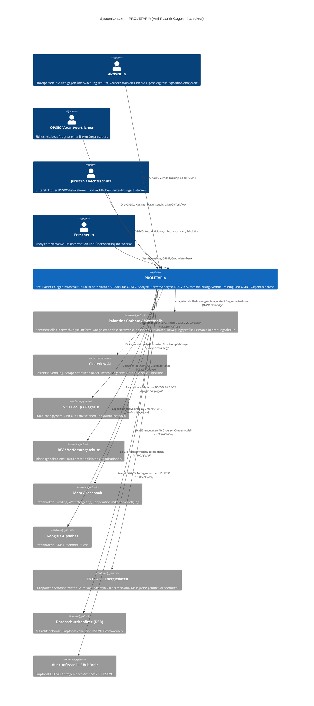

# C4-Modell Level 1 — Systemkontext: PROLETARIA

## Übersicht

Das Systemkontext-Diagramm zeigt PROLETARIA in seiner Umgebung: Wer nutzt das System, welche externen Systeme interagieren damit, und welche Bedrohungsakteure das System abwehren soll. PROLETARIA ist eine defensive Gegeninfrastruktur — ein Anti-Palantir-Konglomerat für linke Organisationen, Aktivist:innen und politische Strukturen, die Überwachung ausgesetzt sind oder ihr entgegenwirken wollen.

---

## Mermaid-Diagramm

---

## Erläuterung der Akteure

### Primäre Nutzer:innen

| Akteur | Beschreibung | Primäre Module |
|--------|-------------|----------------|
| **Aktivist:in** | Einzelperson, die sich selbst schützen will. Führt Selbst-OSINT durch, trainiert Verhörsituationen, analysiert die eigene digitale Spur. | `opsec/`, `verhoer-trainer/` |
| **OPSEC-Verantwortliche:r** | Sicherheitsbeauftragte:r einer Gruppe oder Organisation. Auditiert Kommunikationsmuster, verwaltet DSGVO-Anfragen, konfiguriert Alarmierungen. | `opsec/`, `modules/osint` |
| **Jurist:in** | Rechtsschutz-Akteur. Nutzt DSGVO-Automatisierung, generiert Anfragebriefe, koordiniert Eskalationen an Aufsichtsbehörden. | `opsec/` (DSGVOAutomation) |
| **Forscher:in** | Analysiert Desinformationskampagnen, Narrative, Überwachungsnetzwerke. Nutzt ANTI-KI und OSINT-Module. | `modules/anti-ki`, `modules/osint` |

### Bedrohungsakteure (externe Systeme — keine Kooperation, nur Analyse)

| System | Typ | Relevanz |
|--------|-----|----------|
| **Palantir / Gotham** | Kommerzielle Massenüberwachungsplattform | Primärer Bedrohungsakteur. PROLETARIA ist explizit als Gegenantwort konzipiert. |
| **Clearview AI** | Biometrische Datenbank | Gefährdet physische Anonymität durch Gesichtserkennung aus öffentlichen Quellen. |
| **NSO Group / Pegasus** | Staatliche Spyware-Infrastruktur | Zielt auf Endgeräte. PROLETARIA dokumentiert bekannte Angriffsvektoren. |
| **BfV / Verfassungsschutz** | Inlandsgeheimdienst Deutschland | Beobachtet legale politische Aktivitäten. DSGVO-Anfragen möglich. |
| **Meta / Google** | Datenbrokernetzwerke | Kooperieren mit Strafverfolgungsbehörden, Massenprofilierung. |

### Externe Systeme (kooperativ / neutral)

| System | Funktion | Nutzungsart |
|--------|----------|-------------|
| **ENTSO-E** | Europäisches Energieverbundnetz | Read-only für Cybersyn 2.0 akademisches Steuermodell |
| **Datenschutzbehörde** | DSGVO-Aufsicht | Empfängt eskalierte Beschwerden nach Art. 77 DSGVO |
| **Auskunftsstellen** | Datenverarbeitende Stellen | Empfangen DSGVO Art.15/17/21-Anfragen |

---

## Designprinzipien im Systemkontext

1. **Lokal-First**: PROLETARIA sendet keine Nutzungsdaten an externe Server. Alle KI-Inferenz läuft lokal via Ollama. Kein Cloud-Logging, kein Telemetrie.
2. **Defensive Offensive**: DSGVO-Anfragen, OSINT-Gegenrecherche und Narrativgegenangriffe sind legale Mittel gegen Überwachungsinfrastruktur.
3. **Kein Vertrauen in Dritte**: Keine API-Keys für OpenAI, Anthropic, Google. Alle Modelle sind lokal und auditierbar.
4. **Algedonisches Prinzip**: Bedrohungen werden automatisch eskaliert — nach dem Vorbild von Stafford Beers Cybersyn-Regelkreis (vgl. ADR-003).
5. **Rechtliche Einbettung**: Jede DSGVO-Aktion ist durch explizite Rechtsgrundlagen (Art. 6, 15, 17, 21 DSGVO; Art. 77 DSGVO) abgesichert.
