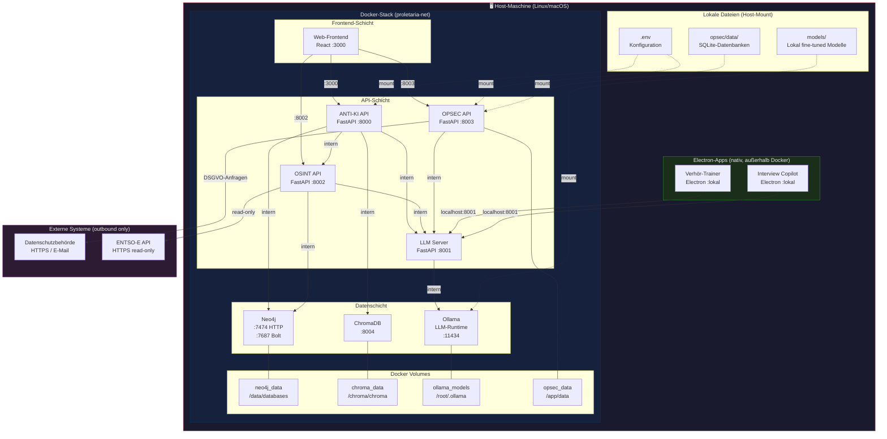

# Deployment-Diagramm: PROLETARIA Docker-Stack

## Übersicht

PROLETARIA ist als vollständig lokaler Stack konzipiert. Kein Cloud-Provider, kein Telemetrie, kein externes Logging. Das Deployment erfolgt via Docker Compose auf einem lokalen Rechner oder einem selbst gehosteten Server innerhalb einer vertrauenswürdigen Organisation.

**Kernprinzipien**:
- **Lokal-First**: Alle Services laufen auf einer Maschine
- **Netzwerk-Isolierung**: Internes Docker-Netzwerk ohne öffentliche Exposition
- **Persistenz via Volumes**: Kein flüchtiger State
- **Kein Cloud-Logging**: Keine Verbindung zu externen Log-Aggregatoren

---

## Mermaid-Diagramm



---

## Port-Mapping (Host → Container)

| Service | Container-Port | Host-Port | Öffentlich? |
|---------|---------------|-----------|-------------|
| Web-Frontend | 3000 | 3000 | Ja (localhost only) |
| ANTI-KI API | 8000 | 8000 | Ja (localhost only) |
| LLM Server | 8001 | 8001 | Ja (localhost only) |
| OSINT API | 8002 | 8002 | Ja (localhost only) |
| OPSEC API | 8003 | 8003 | Ja (localhost only) |
| ChromaDB | 8004 | 8004 | Nein (intern) |
| Neo4j HTTP | 7474 | 7474 | Optional (Dev only) |
| Neo4j Bolt | 7687 | — | Nein (intern) |
| Ollama | 11434 | 11434 | Ja (localhost only) |

**Wichtig**: Alle Port-Bindungen sind standardmäßig auf `127.0.0.1` beschränkt (`127.0.0.1:3000:3000`). Kein Service ist von außen erreichbar.

---

## Docker-Netzwerk-Segmentierung

```
proletaria-net (bridge, intern)
├── anti-ki     172.20.0.2
├── llm-server  172.20.0.3
├── osint       172.20.0.4
├── opsec       172.20.0.5
├── frontend    172.20.0.6
├── neo4j       172.20.0.10
├── chromadb    172.20.0.11
└── ollama      172.20.0.12
```

Alle Container kommunizieren über Service-Namen (DNS-Auflösung im Docker-Netz). Kein Container braucht die IP-Adresse eines anderen.

---

## Volume-Strategie

| Volume | Inhalt | Backup-Priorität |
|--------|--------|-----------------|
| `neo4j_data` | Narrativ-Graphen, OSINT-Daten | HOCH |
| `chroma_data` | Vektoren/Embeddings (regenerierbar) | MITTEL |
| `ollama_models` | LLM-Gewichte (re-downloadbar) | NIEDRIG |
| `opsec_data` | SQLite: Findings, DSGVO-Anfragen | KRITISCH |

**Backup-Empfehlung**: `opsec_data` und `neo4j_data` täglich sichern, verschlüsselt (GPG), auf Offline-Medium.

---

## Ressourcen-Anforderungen

| Dienst | RAM | CPU | Disk |
|--------|-----|-----|------|
| Ollama + Mistral 7B (Q4) | 6–8 GB | 4 Cores | 4 GB |
| Neo4j | 2 GB | 2 Cores | variabel |
| ChromaDB | 1 GB | 1 Core | variabel |
| ANTI-KI API | 512 MB | 1 Core | — |
| OSINT API | 512 MB | 1 Core | — |
| OPSEC API | 256 MB | 1 Core | — |
| LLM Server | 256 MB | 1 Core | — |
| Frontend | 256 MB | 1 Core | — |
| **Gesamt** | **~12 GB** | **12 Cores** | **~10 GB** |

**Mindestanforderungen**: 16 GB RAM, 8-Core-CPU, 20 GB Disk (SSD empfohlen).  
**Empfohlen**: 32 GB RAM für parallelen Betrieb aller Services und Ollama-Inferenz.

---

## Sicherheitsaspekte Deployment

1. **Kein Internet-Exposure**: Alle Ports an `127.0.0.1` gebunden. Für Mehrbenutzerbetrieb: VPN-Only-Zugang.
2. **Kein externes Logging**: Keine Sentry, Datadog, CloudWatch. Logs nur lokal via Docker Logging Driver `json-file` mit Rotation.
3. **Secrets via `.env`**: Keine Hardcoded Credentials. `.env` außerhalb des Git-Repos, 600-Permissions.
4. **Ollama offline**: Nach initialem Modell-Download kann Ollama vollständig offline betrieben werden (`OLLAMA_HOST=127.0.0.1`).
5. **Neo4j Auth**: Standardmäßig mit Passwort aus `.env`. Bolt-Port nicht nach außen exponiert.
