# Gramsci — Klassendiagramm

```mermaid
classDiagram
    %% ── Enumerationen ──────────────────────────────────────────
    class ContentType {
        <<enumeration>>
        SHORT_POST
        THREAD
        COMMENT_RESPONSE
        LONG_FORM
        PRESS_RELEASE
        LETTER_TO_EDITOR
        FLYER
        NEWSLETTER
        MEME_TEXT
        PETITION_TEXT
        PUBLIC_STATEMENT
    }

    class CampaignStatus {
        <<enumeration>>
        ENTWURF
        BEREIT
        TEILWEISE
        ABGESCHLOSSEN
        ARCHIVIERT
    }

    class NarrativeType {
        <<enumeration>>
        RECHTSEXTREM
        ISLAMFEINDLICH
        ANTIFEMINISTISCH
        KLIMALEUGNUNG
        VERSCHWÖRUNG
        RASSISTISCH
        ANTIKOMMUNISMUS
        POLIZEIPROPAGANDA
        NEOLIBERAL
        NEUTRAL
    }

    class ThreatLevel {
        <<enumeration>>
        GERING
        MITTEL
        HOCH
        KRITISCH
    }

    %% ── Dataclass GeneratedContent ─────────────────────────────
    class GeneratedContent {
        +str text
        +ContentType content_type
        +str language
        +str platform
        +str topic
        +int char_count
        +bool approved
        +str edited_text
        +str final_text
        +fits_platform() bool
    }

    %% ── ContentEngine ──────────────────────────────────────────
    class ContentEngine {
        +str llm_server
        +generate(topic, content_type, platform, language, context) GeneratedContent
        -_build_prompt(topic, content_type, platform, language, context) str
        -_call_llm(prompt) str
        -_trim_to_limit(text, platform) str
    }

    %% ── Campaign-Modell ────────────────────────────────────────
    class CampaignItem {
        +GeneratedContent content
        +str channel_adapter
        +str scheduled_at
        +str published_at
        +str publish_url
        +is_ready bool
    }

    class Campaign {
        +str id
        +str name
        +str topic
        +str created_at
        +CampaignStatus status
        +list~CampaignItem~ items
        +list~str~ tags
        +str notes
        +int total_items
        +int approved_items
        +float progress
    }

    class CampaignManager {
        +Path campaign_dir
        +create(name, topic, platforms, languages, content_type) Campaign
        +get(campaign_id) Campaign
        +list_all() list~Campaign~
        +save(campaign) None
        +load(campaign_id) Campaign
        +delete(campaign_id) None
    }

    %% ── NarrativeRadar ─────────────────────────────────────────
    class NarrativeAnalysis {
        +str text
        +NarrativeType narrative_type
        +ThreatLevel threat_level
        +list~str~ detected_frames
        +str counter_narrative
        +float confidence
    }

    class NarrativeRadar {
        +str llm_server
        +analyze(text) NarrativeAnalysis
        +generate_counter(analysis) str
        -_detect_frames(text) list~str~
        -_classify(text, frames) NarrativeType
        -_llm_counter(analysis) str
    }

    %% ── Kanal-Adapter ──────────────────────────────────────────
    class PublishResult {
        +bool success
        +str url
        +str post_id
        +str error
        +str channel
    }

    class BaseChannelAdapter {
        <<abstract>>
        +str channel_name
        +publish(content) PublishResult
        +validate_credentials() bool
        #_do_publish(content) PublishResult
    }

    class MastodonAdapter {
        +str channel_name
        #_do_publish(content) PublishResult
    }

    class TwitterAdapter {
        +str channel_name
        #_do_publish(content) PublishResult
    }

    class TelegramAdapter {
        +str channel_name
        #_do_publish(content) PublishResult
    }

    class RedditAdapter {
        +str channel_name
        #_do_publish(content) PublishResult
    }

    class FacebookAdapter {
        +str channel_name
        #_do_publish(content) PublishResult
    }

    class InstagramAdapter {
        +str channel_name
        #_do_publish(content) PublishResult
    }

    class TikTokAdapter {
        +str channel_name
        #_do_publish(content) PublishResult
    }

    class YouTubeCommentAdapter {
        +str channel_name
        #_do_publish(content) PublishResult
    }

    class NewsSiteCommentAdapter {
        +str channel_name
        #_do_publish(content) PublishResult
    }

    class PetitionAdapter {
        +str channel_name
        #_do_publish(content) PublishResult
    }

    class PublicConsultationAdapter {
        +str channel_name
        #_do_publish(content) PublishResult
    }

    class PressReleaseAdapter {
        +str channel_name
        #_do_publish(content) PublishResult
    }

    class LetterToEditorAdapter {
        +str channel_name
        #_do_publish(content) PublishResult
    }

    class FlyerGeneratorAdapter {
        +str channel_name
        #_do_publish(content) PublishResult
    }

    class NewsletterAdapter {
        +str channel_name
        #_do_publish(content) PublishResult
    }

    %% ── ReviewCLI ──────────────────────────────────────────────
    class ReviewCLI {
        +CampaignManager manager
        +review_content(content) bool
        +review_campaign(campaign) None
        +campaign_menu() None
        -_show_content(content) None
        -_prompt_edit(content) None
        -_prompt_publish(content) PublishResult
    }

    %% ── Beziehungen ────────────────────────────────────────────
    ContentEngine ..> GeneratedContent : erzeugt
    ContentEngine ..> ContentType : nutzt
    GeneratedContent --> ContentType : hat

    CampaignItem --> GeneratedContent : enthält
    Campaign "1" --> "1..*" CampaignItem : enthält
    Campaign --> CampaignStatus : hat
    CampaignManager --> Campaign : verwaltet

    NarrativeRadar ..> NarrativeAnalysis : erzeugt
    NarrativeAnalysis --> NarrativeType : hat
    NarrativeAnalysis --> ThreatLevel : hat

    BaseChannelAdapter ..> GeneratedContent : publiziert
    BaseChannelAdapter ..> PublishResult : erzeugt

    MastodonAdapter --|> BaseChannelAdapter
    TwitterAdapter --|> BaseChannelAdapter
    TelegramAdapter --|> BaseChannelAdapter
    RedditAdapter --|> BaseChannelAdapter
    FacebookAdapter --|> BaseChannelAdapter
    InstagramAdapter --|> BaseChannelAdapter
    TikTokAdapter --|> BaseChannelAdapter
    YouTubeCommentAdapter --|> BaseChannelAdapter
    NewsSiteCommentAdapter --|> BaseChannelAdapter
    PetitionAdapter --|> BaseChannelAdapter
    PublicConsultationAdapter --|> BaseChannelAdapter
    PressReleaseAdapter --|> BaseChannelAdapter
    LetterToEditorAdapter --|> BaseChannelAdapter
    FlyerGeneratorAdapter --|> BaseChannelAdapter
    NewsletterAdapter --|> BaseChannelAdapter

    ReviewCLI --> CampaignManager : nutzt
    ReviewCLI ..> GeneratedContent : reviewed
    ReviewCLI ..> BaseChannelAdapter : delegiert publish
```

## Beschreibungen

### ContentEngine
Zentrale Generierungs-Engine. Baut Prompts für ProletariaLLM und trimmt generierten Text auf Plattform-Limits. Nutzt `http://localhost:8001` als LLM-Bridge. Unterstützt 7 Sprachen (DE, EN, FR, NL, ES, IT, PL).

### GeneratedContent
Immutable Dataclass für generierten Inhalt. `approved=False` solange ReviewCLI nicht bestätigt hat. `final_text` gibt `edited_text` zurück falls vorhanden, sonst `text`. `fits_platform()` prüft gegen `FORMAT_LIMITS`.

### CampaignManager
Persistiert Kampagnen als JSON in `GRAMSCI_CAMPAIGN_DIR` (Standard: `.gramsci_campaigns/`). Verwaltet Lebenszyklus von ENTWURF bis ARCHIVIERT.

### NarrativeRadar
Analysiert Texte auf reaktionäre Frames mittels Pattern-Matching + ProletariaLLM. Gibt Gegennarrativ-Vorschläge zurück. Speist ContentEngine mit Kontext für gezielte Gegenkommunikation.

### BaseChannelAdapter
Abstrakte Basis mit Guard-Clause: `publish()` lehnt ab wenn `approved=False` oder Zeichenlimit überschritten. Alle 14 Adapter-Klassen halten dieses Prinzip ein.

### Adapter-Gruppen

| Gruppe | Adapter |
|--------|---------|
| Social | Mastodon, Twitter, Reddit, Telegram, Facebook, Instagram, TikTok |
| Kommentare | YouTubeComment, NewsSiteComment |
| Zivilgesellschaft | Petition, PublicConsultation |
| Medien | PressRelease, LetterToEditor |
| Print/Newsletter | FlyerGenerator, Newsletter |

### ReviewCLI
Terminal-Interface. Kernprinzip: Kein Inhalt verlässt das System ohne explizite Bestätigung. Unterstützt Inline-Editing vor Freigabe. ANSI-Farbausgabe (mit TTY-Erkennung).
