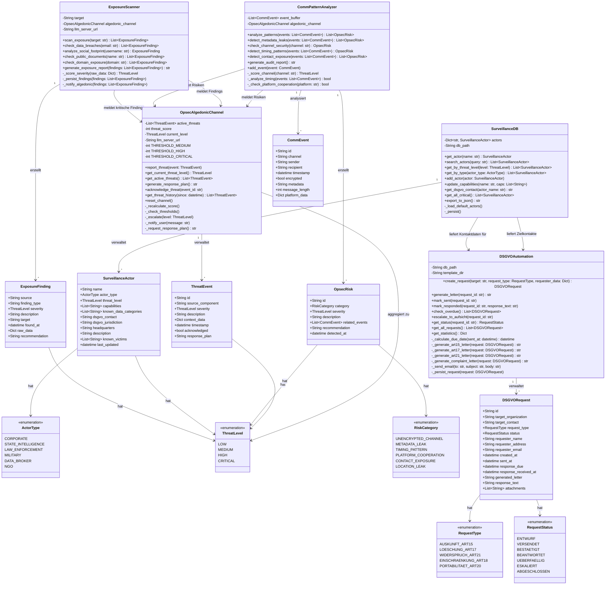

# UML-Klassendiagramm: OPSEC-Modul

## Vollständiges Klassendiagramm

---

## Attribut- und Methodenbeschreibungen

### ExposureScanner

| Methode | Eingabe | Ausgabe | Beschreibung |
|---------|---------|---------|--------------|
| `scan_exposure` | `target: str` | `List[ExposureFinding]` | Vollständiger Multi-Source-Scan |
| `check_data_breaches` | `email: str` | `List[ExposureFinding]` | Prüft bekannte Datenlecks |
| `analyze_social_footprint` | `username: str` | `ExposureFinding` | Analysiert Social-Media-Spuren |
| `check_public_documents` | `name: str` | `List[ExposureFinding]` | Öffentliche Dokument-Recherche |
| `generate_exposure_report` | `findings: List` | `str` | Markdown-Bericht |

### SurveillanceDB — Vorbefüllte Akteure

Die Datenbank enthält standardmäßig folgende Akteure:

| Name | Typ | Threat Level |
|------|-----|-------------|
| Palantir Technologies | CORPORATE | CRITICAL |
| Clearview AI | CORPORATE | HIGH |
| NSO Group | CORPORATE | CRITICAL |
| Bundesamt für Verfassungsschutz | STATE_INTELLIGENCE | HIGH |
| Meta Platforms | DATA_BROKER | HIGH |
| Google LLC | DATA_BROKER | MEDIUM |
| Axciom | DATA_BROKER | MEDIUM |

### DSGVOAutomation — Fristen

| Aktion | Frist | Rechtsgrundlage |
|--------|-------|----------------|
| Antwort auf Art.15 | 30 Tage | Art. 12 Abs. 3 DSGVO |
| Antwort auf Art.17 | Unverzüglich | Art. 17 Abs. 1 DSGVO |
| Eskalation bei Überschreitung | Nach 30 Tagen | Art. 77 DSGVO |
| Beschwerde DSB | Sofort möglich | Art. 77 Abs. 1 DSGVO |

### OpsecAlgedonicChannel — Schwellenwerte

| Score | Level | Reaktion |
|-------|-------|---------|
| 0–29 | LOW | Logging, kein Alert |
| 30–59 | MEDIUM | Alert an Nutzer:in |
| 60–79 | HIGH | Dringende Handlungsempfehlungen |
| 80–100 | CRITICAL | Response-Plan via LLM, sofortige Eskalation |
