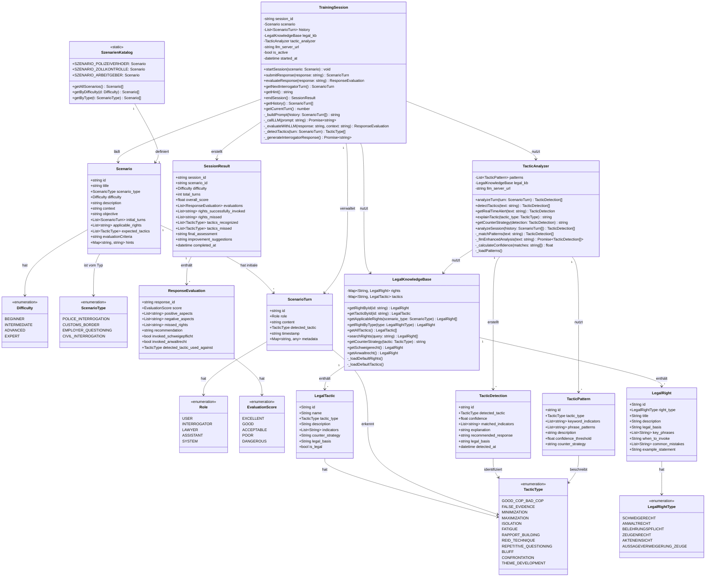

# UML-Klassendiagramm: Verhör-Trainer

## Vollständiges Klassendiagramm

---

## Szenarienbeschreibungen

### Szenario 1: Polizeiverhör (POLICE_INTERROGATION)

**Schwierigkeit**: ADVANCED  
**Kontext**: Aktivist:in wird nach einer Demonstration zur Polizeiwache vorgeladen. Beschuldigtenstatus unklar.  
**Ziel**: §136 StPO-Rechte wahrnehmen. Schweigerecht korrekt ausüben. Anwalt anfordern.  
**Erwartete Taktiken**: REID_TECHNIQUE, RAPPORT_BUILDING, FALSE_EVIDENCE, MINIMIZATION  
**Rechtliche Grundlagen**:
- § 136 StPO: Belehrung Beschuldigter
- § 163a StPO: Vernehmung Beschuldigter
- Art. 6 EMRK: Recht auf faires Verfahren

### Szenario 2: Zollkontrolle (CUSTOMS_BORDER)

**Schwierigkeit**: INTERMEDIATE  
**Kontext**: Grenzübergang. Laptop und Handy werden gefordert. Keine klare Rechtsgrundlage genannt.  
**Ziel**: Rechte kennen, kooperieren ohne selbst zu belasten, Grenzen erkennen.  
**Erwartete Taktiken**: ISOLATION, MAXIMIZATION, FATIGUE  
**Rechtliche Grundlagen**:
- § 12 ZollVG
- Grundgesetz Art. 13 (Unverletzlichkeit der Wohnung/Eigentum)

### Szenario 3: Arbeitgeberbefragung (EMPLOYER_QUESTIONING)

**Schwierigkeit**: BEGINNER  
**Kontext**: Arbeitgeber befragt Mitarbeiter:in zu politischen Aktivitäten außerhalb der Arbeitszeit.  
**Ziel**: Grenzen der Auskunftspflicht erkennen. Persönlichkeitsrecht wahren.  
**Erwartete Taktiken**: RAPPORT_BUILDING, THEME_DEVELOPMENT, GOOD_COP_BAD_COP  
**Rechtliche Grundlagen**:
- BDSG § 26: Datenschutz im Beschäftigungsverhältnis
- GG Art. 1/2: Persönlichkeitsrecht

---

## LegalKnowledgeBase — Schlüsselrechte

| Recht | § / Norm | Wann anwenden |
|-------|----------|---------------|
| **Schweigerecht** | § 136 StPO | Sofort bei jeder Vernehmung als Beschuldigte:r |
| **Recht auf Anwalt** | § 137 StPO, Art. 6 EMRK | Unmittelbar nach Feststellung Beschuldigtenstatus |
| **Belehrungspflicht** | § 136 Abs. 1 StPO | Muss vor Vernehmung erfolgen — wenn nicht: Widerspruch |
| **Zeugen-Verweigerung** | § 55 StPO | Wenn Aussage zur Selbstbelastung führen kann |
| **Akteneinsicht** | § 147 StPO | Über Verteidiger:in jederzeit möglich |
