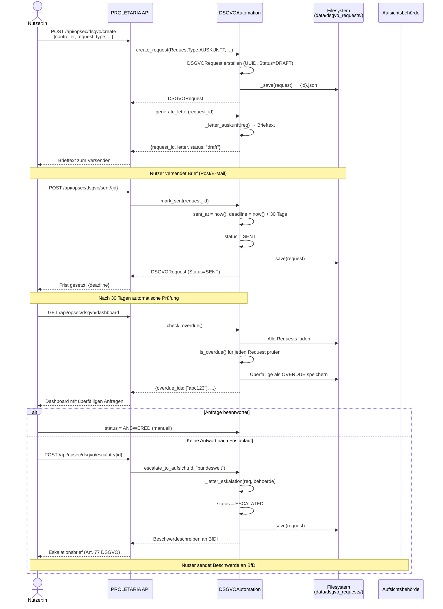
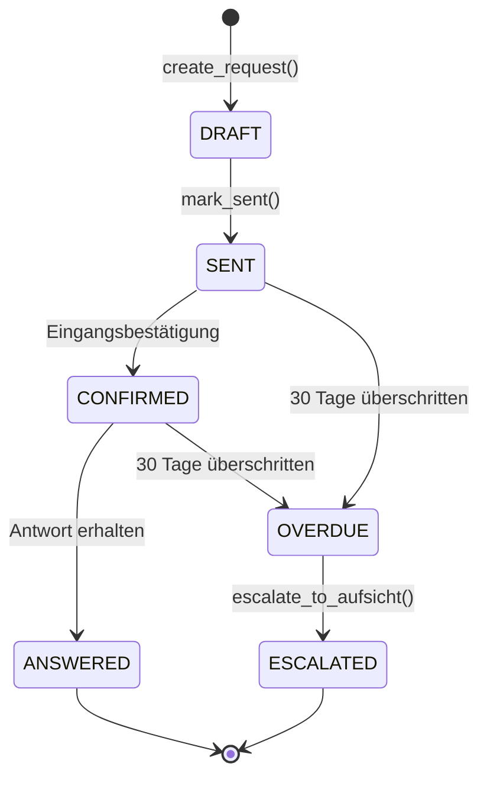

# DSGVO-Automatisierung — Sequenzdiagramm

## Vollständiger Workflow: Anfrage → Eskalation

## Rechtliche Fristen

| Schritt | Frist | Rechtsgrundlage |
|---------|-------|-----------------|
| Erste Antwort | 30 Tage | Art. 12 Abs. 3 DSGVO |
| Verlängerung (komplex) | +60 Tage mit Begründung | Art. 12 Abs. 3 DSGVO |
| Beschwerde bei Aufsicht | Jederzeit | Art. 77 DSGVO |
| Aufsicht antwortet | 3 Monate | Art. 78 DSGVO |

## Request-Status-Maschine

