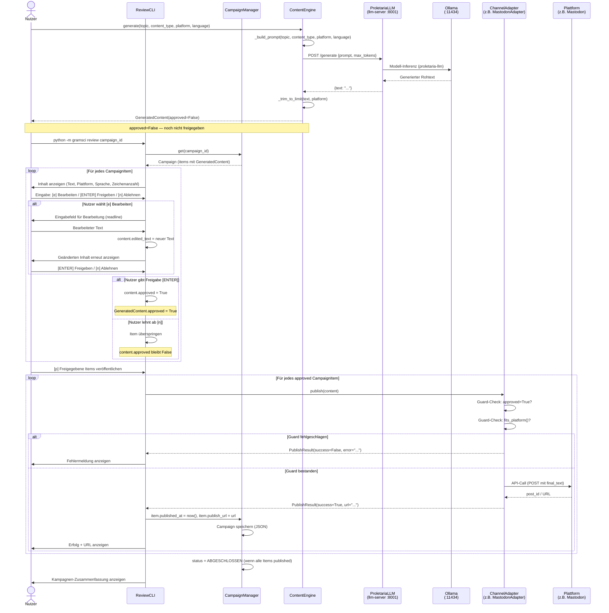
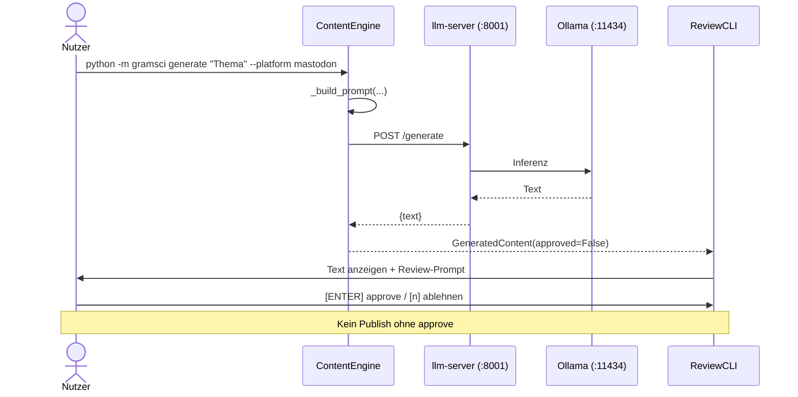

# Gramsci — Sequenzdiagramm: Knopfdruck-Flow

Zeigt den vollständigen Ablauf von der Nutzereingabe bis zur Veröffentlichung auf einer Plattform.

## Anmerkungen

### Sicherheits-Invarianten

| Punkt | Invariante |
|-------|-----------|
| Nach `generate()` | `content.approved == False` immer |
| `BaseChannelAdapter.publish()` | Lehnt ab wenn `approved == False` |
| `BaseChannelAdapter.publish()` | Lehnt ab wenn `fits_platform() == False` |
| `CampaignItem.is_ready` | `approved AND fits_platform()` |
| Persistenz | `published_at` wird erst nach erfolgreichem API-Call gesetzt |

### Kurzbefehl ohne Kampagne

