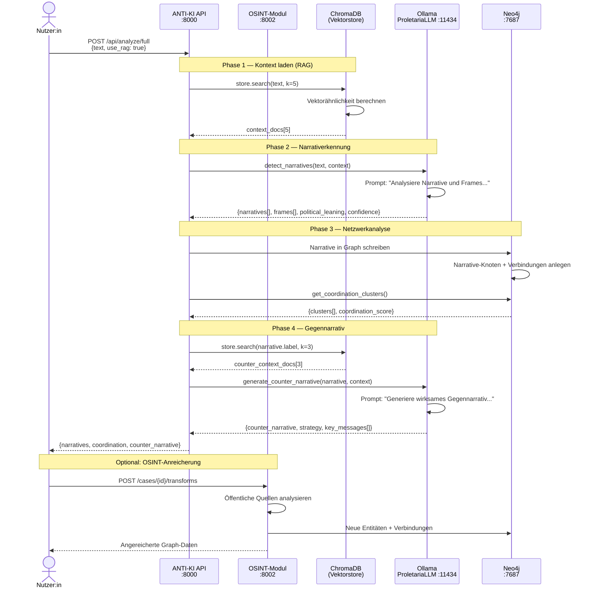
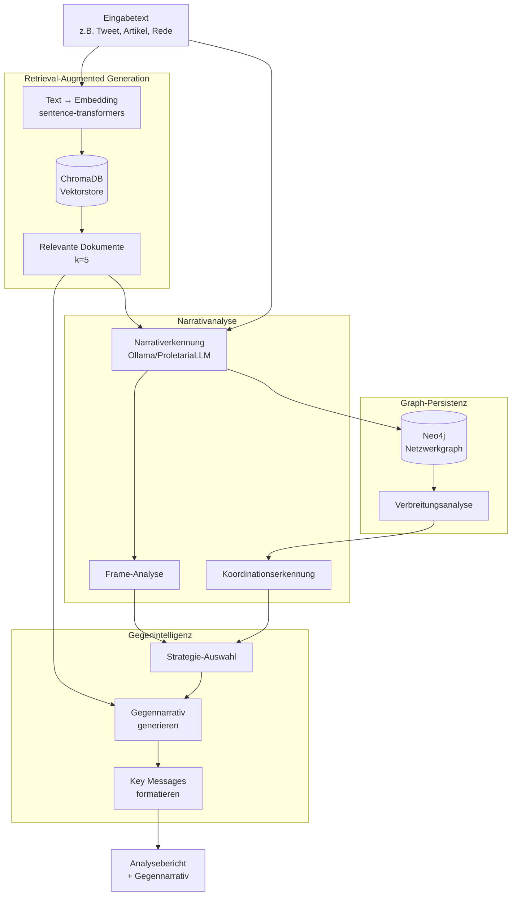

# Narrativanalyse-Pipeline — Sequenzdiagramm

## Vollständiger Flow: Eingabe → Gegennarrativ

```mermaid
sequenceDiagram
    actor N as Nutzer:in
    participant API as ANTI-KI API<br/>:8000
    participant OSINT as OSINT-Modul<br/>:8002
    participant RAG as ChromaDB<br/>(Vektorstore)
    participant LLM as Ollama<br/>ProletariaLLM :11434
    participant GDB as Neo4j<br/>:7687

    N->>API: POST /api/analyze/full<br/>{text, use_rag: true}

    Note over API,RAG: Phase 1 — Kontext laden (RAG)
    API->>RAG: store.search(text, k=5)
    RAG->>RAG: Vektorähnlichkeit berechnen
    RAG-->>API: context_docs[5]

    Note over API,LLM: Phase 2 — Narrativerkennung
    API->>LLM: detect_narratives(text, context)
    LLM->>LLM: Prompt: "Analysiere Narrative und Frames..."
    LLM-->>API: {narratives[], frames[], political_leaning, confidence}

    Note over API,GDB: Phase 3 — Netzwerkanalyse
    API->>GDB: Narrative in Graph schreiben
    GDB->>GDB: Narrative-Knoten + Verbindungen anlegen
    API->>GDB: get_coordination_clusters()
    GDB-->>API: {clusters[], coordination_score}

    Note over API,LLM: Phase 4 — Gegennarrativ
    API->>RAG: store.search(narrative.label, k=3)
    RAG-->>API: counter_context_docs[3]
    API->>LLM: generate_counter_narrative(narrative, context)
    LLM->>LLM: Prompt: "Generiere wirksames Gegennarrativ..."
    LLM-->>API: {counter_narrative, strategy, key_messages[]}

    API-->>N: {narratives, coordination, counter_narrative}

    Note over N,OSINT: Optional: OSINT-Anreicherung
    N->>OSINT: POST /cases/{id}/transforms
    OSINT->>OSINT: Öffentliche Quellen analysieren
    OSINT->>GDB: Neue Entitäten + Verbindungen
    OSINT-->>N: Angereicherte Graph-Daten
```

## Datenfluss-Diagramm

```mermaid
flowchart TD
    INPUT[Eingabetext\nz.B. Tweet, Artikel, Rede]

    subgraph RAG[Retrieval-Augmented Generation]
        EMBED[Text → Embedding\nsentence-transformers]
        CHROMA[(ChromaDB\nVektorstore)]
        DOCS[Relevante Dokumente\nk=5]
    end

    subgraph ANALYSIS[Narrativanalyse]
        DETECT[Narrativerkennung\nOllama/ProletariaLLM]
        FRAMES[Frame-Analyse]
        COORD[Koordinationserkennung]
    end

    subgraph GRAPH[Graph-Persistenz]
        NEO4J[(Neo4j\nNetzwerkgraph)]
        SPREAD[Verbreitungsanalyse]
    end

    subgraph COUNTER[Gegenintelligenz]
        STRATEGY[Strategie-Auswahl]
        GENERATE[Gegennarrativ\ngenerieren]
        MESSAGES[Key Messages\nformatieren]
    end

    INPUT --> EMBED
    EMBED --> CHROMA
    CHROMA --> DOCS
    DOCS --> DETECT
    INPUT --> DETECT
    DETECT --> FRAMES
    DETECT --> NEO4J
    NEO4J --> SPREAD
    SPREAD --> COORD
    FRAMES --> STRATEGY
    COORD --> STRATEGY
    DOCS --> GENERATE
    STRATEGY --> GENERATE
    GENERATE --> MESSAGES
    MESSAGES --> OUTPUT[Analysebericht\n+ Gegennarrativ]
```
