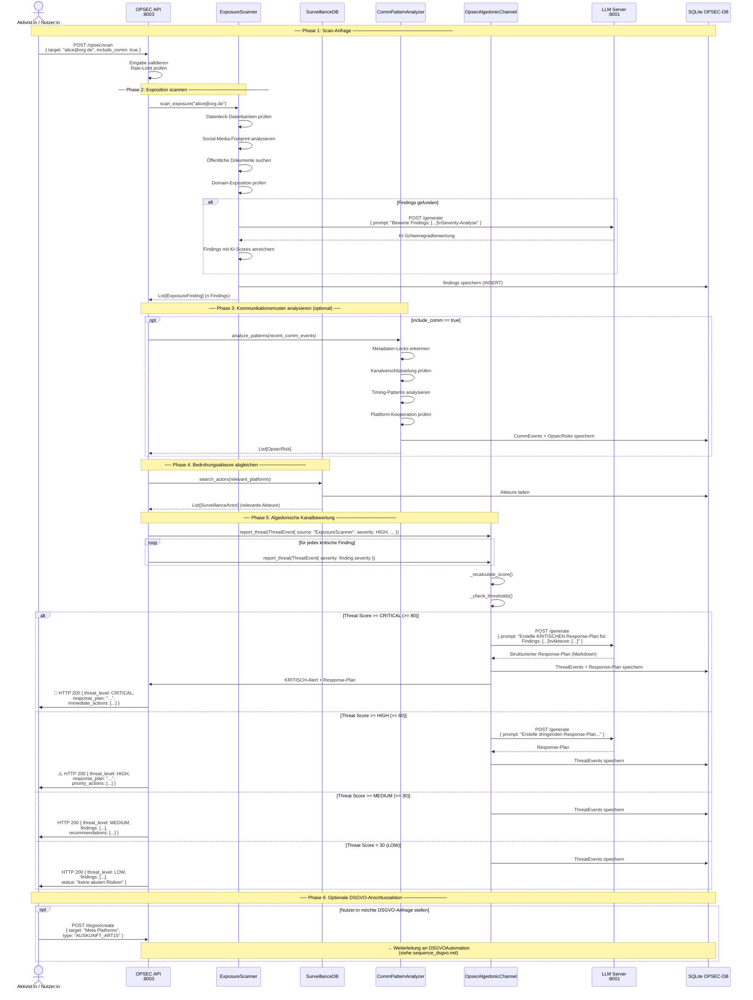
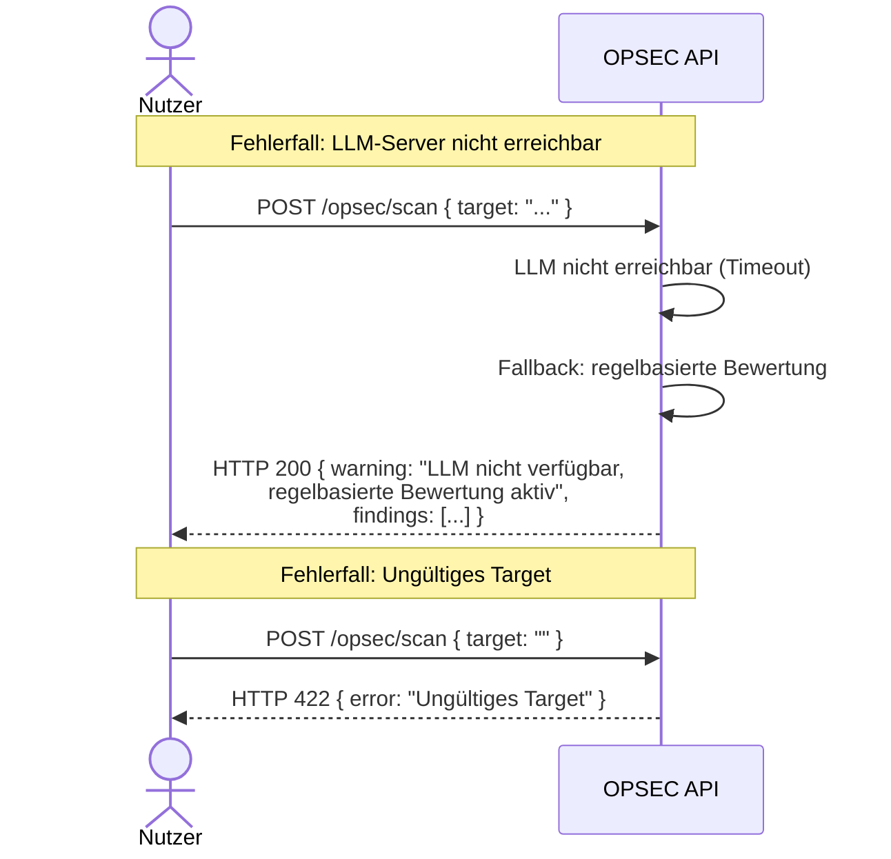

# Sequenzdiagramm: OPSEC-Scan-Flow

## Vollständiger Ablauf eines OPSEC-Scans

---

## Erläuterung der Phasen

### Phase 1: Scan-Anfrage
Die Nutzer:in sendet einen POST-Request mit einem Ziel (E-Mail, Name, Username, Domain). Die API validiert die Eingabe und prüft ein Rate-Limit (max. 10 Scans/Stunde), um Missbrauch zu verhindern.

### Phase 2: Expositions-Scan
`ExposureScanner` führt parallel mehrere OSINT-Checks durch:
- **Datenlecks**: Abgleich mit bekannten Breach-Datenbanken
- **Social-Media-Footprint**: Öffentliche Profile, Posts, Verknüpfungen
- **Öffentliche Dokumente**: Presseartikel, Gerichtsdokumente, Vereinsregister
- **Domain**: WHOIS, DNS-History, verbundene Infrastruktur

Nach dem Scan bewertet das LLM die Findings und vergibt Schweregrade.

### Phase 3: Kommunikationsmuster (optional)
Bei `include_comm: true` analysiert der `CommPatternAnalyzer` vorliegende Kommunikationsereignisse auf OPSEC-Risiken.

### Phase 4: Bedrohungsakteure
`SurveillanceDB` liefert Informationen zu Akteuren, die mit den gefundenen Plattformen und Daten in Verbindung stehen.

### Phase 5: Algedonische Kanalbewertung (Kernstück)
Der `OpsecAlgedonicChannel` aggregiert alle Bedrohungssignale zu einem Gesamt-Score. Bei Überschreitung von Schwellenwerten:
- **LOW (< 30)**: Nur Logging
- **MEDIUM (30–59)**: Alert + Empfehlungen
- **HIGH (60–79)**: Dringender Response-Plan via LLM
- **CRITICAL (≥ 80)**: Sofort-Aktionsplan, priorisierte Gegenmaßnahmen

### Phase 6: DSGVO-Anschluss
Falls eine Plattform identifiziert wurde, die personenbezogene Daten verarbeitet, kann die Nutzer:in direkt eine DSGVO-Anfrage auslösen.

---

## Fehlerfälle

