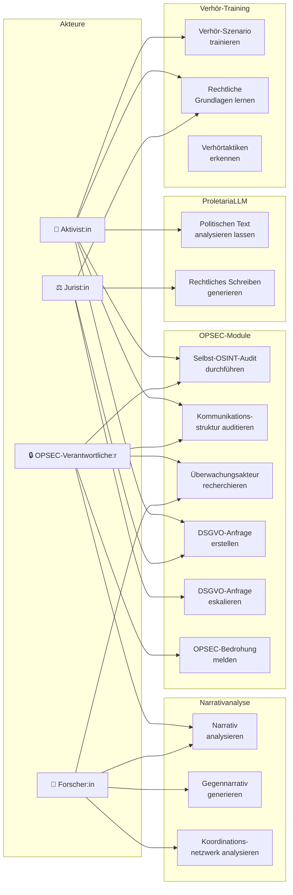

# PROLETARIA — Use-Case-Übersicht

## Akteure und Use Cases

## Use-Case-Beschreibungen

### UC1: Selbst-OSINT-Audit

| Feld | Inhalt |
|------|--------|
| **Akteur** | Aktivist:in, OPSEC-Verantwortliche:r |
| **Ziel** | Eigene digitale Spuren erkennen bevor staatliche Akteure es tun |
| **Vorbedingung** | Zugang zu PROLETARIA API |
| **Hauptfluss** | Text/Datei einreichen → ExposureScanner analysiert → Findings mit Severity → Risikoprofil |
| **Alternativfluss** | Datei-Metadaten-Scan (EXIF, Office-Metadaten) |
| **Ergebnis** | Risiko-Score + konkrete Handlungsempfehlungen |

### UC4: DSGVO-Anfrage erstellen

| Feld | Inhalt |
|------|--------|
| **Akteur** | Aktivist:in, Jurist:in |
| **Ziel** | Rechtskonforme Auskunftsanfrage gegen Überwachungsakteur generieren |
| **Vorbedingung** | Name + Adresse des Verantwortlichen bekannt |
| **Hauptfluss** | Anfrage-Typ wählen (Art.15/17/21) → Daten eingeben → Brief generieren → Versenden → Frist überwachen |
| **Alternativfluss** | Massenanfragen gegen mehrere Verantwortliche |
| **Ausnahme** | Keine Antwort → Automatische Eskalation an BfDI |
| **Ergebnis** | Rechtsgültiger Brief + Fristen-Tracking |

### UC10: Verhör-Szenario trainieren

| Feld | Inhalt |
|------|--------|
| **Akteur** | Aktivist:in |
| **Ziel** | Psychologische Vorbereitung auf polizeiliche Befragung |
| **Vorbedingung** | keine |
| **Hauptfluss** | Szenario wählen (Einsteiger/Fortgeschritten/Experte) → Fragen beantworten → Echtzeit-Feedback → Auswertung |
| **Alternativfluss** | TacticAnalyzer-Modus: realen Verhörtext eingeben → Taktik erkennen |
| **Ergebnis** | Zertifikat (bestanden/nicht bestanden) + Verbesserungshinweise |

### UC7: Narrativ analysieren

| Feld | Inhalt |
|------|--------|
| **Akteur** | OPSEC-Verantwortliche:r, Forscher:in |
| **Ziel** | Rechte/staatliche Narrative in Texten erkennen und verstehen |
| **Vorbedingung** | ProletariaLLM / Ollama läuft |
| **Hauptfluss** | Text einreichen → Narrative erkannt → Frames analysiert → Gegennarrativ generiert |
| **Ergebnis** | Vollständige Analyse + handlungsfähige Gegenstrategien |
