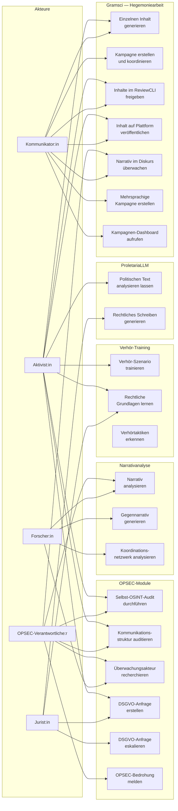

# PROLETARIA — Use-Case-Übersicht

## Akteure und Use Cases

## Use-Case-Beschreibungen

### UC1: Selbst-OSINT-Audit

| Feld | Inhalt |
|------|--------|
| **Akteur** | Aktivist:in, OPSEC-Verantwortliche:r |
| **Ziel** | Eigene digitale Spuren erkennen bevor staatliche Akteure es tun |
| **Vorbedingung** | Zugang zu PROLETARIA API |
| **Hauptfluss** | Text/Datei einreichen → ExposureScanner analysiert → Findings mit Severity → Risikoprofil |
| **Alternativfluss** | Datei-Metadaten-Scan (EXIF, Office-Metadaten) |
| **Ergebnis** | Risiko-Score + konkrete Handlungsempfehlungen |

### UC4: DSGVO-Anfrage erstellen

| Feld | Inhalt |
|------|--------|
| **Akteur** | Aktivist:in, Jurist:in |
| **Ziel** | Rechtskonforme Auskunftsanfrage gegen Überwachungsakteur generieren |
| **Vorbedingung** | Name + Adresse des Verantwortlichen bekannt |
| **Hauptfluss** | Anfrage-Typ wählen (Art.15/17/21) → Daten eingeben → Brief generieren → Versenden → Frist überwachen |
| **Alternativfluss** | Massenanfragen gegen mehrere Verantwortliche |
| **Ausnahme** | Keine Antwort → Automatische Eskalation an BfDI |
| **Ergebnis** | Rechtsgültiger Brief + Fristen-Tracking |

### UC10: Verhör-Szenario trainieren

| Feld | Inhalt |
|------|--------|
| **Akteur** | Aktivist:in |
| **Ziel** | Psychologische Vorbereitung auf polizeiliche Befragung |
| **Vorbedingung** | keine |
| **Hauptfluss** | Szenario wählen (Einsteiger/Fortgeschritten/Experte) → Fragen beantworten → Echtzeit-Feedback → Auswertung |
| **Alternativfluss** | TacticAnalyzer-Modus: realen Verhörtext eingeben → Taktik erkennen |
| **Ergebnis** | Zertifikat (bestanden/nicht bestanden) + Verbesserungshinweise |

### UC7: Narrativ analysieren

| Feld | Inhalt |
|------|--------|
| **Akteur** | OPSEC-Verantwortliche:r, Forscher:in |
| **Ziel** | Rechte/staatliche Narrative in Texten erkennen und verstehen |
| **Vorbedingung** | ProletariaLLM / Ollama läuft |
| **Hauptfluss** | Text einreichen → Narrative erkannt → Frames analysiert → Gegennarrativ generiert |
| **Ergebnis** | Vollständige Analyse + handlungsfähige Gegenstrategien |

### UC15: Einzelnen Inhalt generieren

| Feld | Inhalt |
|------|--------|
| **Akteur** | Aktivist:in, Kommunikator:in |
| **Ziel** | Einen politischen Text für eine bestimmte Plattform generieren |
| **Vorbedingung** | ProletariaLLM läuft (`llm-server` auf `:8001`) |
| **Hauptfluss** | `python -m gramsci generate "Thema" --platform mastodon --lang de` → ContentEngine generiert → ReviewCLI zeigt an → Freigabe → optional Veröffentlichen |
| **Alternativfluss** | `--no-review` für direkte Ausgabe ohne interaktives Review |
| **Ergebnis** | Freigegebener oder abgelehnter GeneratedContent |

### UC16: Kampagne erstellen und koordinieren

| Feld | Inhalt |
|------|--------|
| **Akteur** | Kommunikator:in |
| **Ziel** | Mehrere Inhalte für verschiedene Plattformen und Sprachen als zusammenhängende Kampagne koordinieren |
| **Vorbedingung** | ProletariaLLM läuft |
| **Hauptfluss** | `CampaignManager.create(name, topic, platforms, languages)` → Für jede Plattform+Sprache-Kombination ContentEngine generiert → Kampagne persistiert als JSON |
| **Ergebnis** | Kampagne im Status ENTWURF mit allen Items |

### UC17: Inhalte im ReviewCLI freigeben

| Feld | Inhalt |
|------|--------|
| **Akteur** | Aktivist:in, Kommunikator:in |
| **Ziel** | Jeden generierten Inhalt vor Veröffentlichung sichten, ggf. bearbeiten und freigeben |
| **Vorbedingung** | Kampagne mit generierten Items existiert |
| **Hauptfluss** | `python -m gramsci review <id>` → ReviewCLI zeigt Item → [e] bearbeiten / [ENTER] freigeben / [n] ablehnen → Alle Items durchlaufen |
| **Invariante** | Kein Inhalt erhält `approved=True` ohne explizite Nutzereingabe |
| **Ergebnis** | Items mit `approved=True` bereit für Veröffentlichung |

### UC18: Inhalt auf Plattform veröffentlichen

| Feld | Inhalt |
|------|--------|
| **Akteur** | Kommunikator:in |
| **Ziel** | Freigegebenen Inhalt über den konfigurierten Kanal-Adapter senden |
| **Vorbedingung** | `content.approved=True`, API-Credentials in `.env` konfiguriert |
| **Hauptfluss** | ReviewCLI → `[p]` → ChannelAdapter.publish(content) → Guard-Check → API-Call → PublishResult → URL persistiert |
| **Ausnahme** | Guard schlägt fehl (nicht freigegeben oder Zeichenlimit) → Fehlermeldung, kein Publish |
| **Ergebnis** | `CampaignItem.published_at` gesetzt, URL gespeichert |

### UC19: Narrativ im Diskurs überwachen

| Feld | Inhalt |
|------|--------|
| **Akteur** | Kommunikator:in, OPSEC-Verantwortliche:r |
| **Ziel** | Reaktionäre Frames und Desinformation in Texten erkennen, um gezielte Gegeninhalte zu generieren |
| **Vorbedingung** | ProletariaLLM läuft |
| **Hauptfluss** | `NarrativeRadar.analyze(text)` → Frames erkannt → ThreatLevel bewertet → `generate_counter()` → Gegennarrativ als ContentEngine-Kontext |
| **Ergebnis** | NarrativeAnalysis mit counter_narrative + ThreatLevel |

### UC20: Mehrsprachige Kampagne erstellen

| Feld | Inhalt |
|------|--------|
| **Akteur** | Kommunikator:in |
| **Ziel** | Dasselbe Thema in mehreren Sprachen für internationale Vernetzung aufbereiten |
| **Vorbedingung** | ProletariaLLM mit mehrsprachiger Kompetenz (DE/EN/FR/NL/ES/IT/PL) |
| **Hauptfluss** | CampaignManager.create(..., languages=["de","en","fr"]) → ContentEngine für jede Sprache → separate GeneratedContent-Objekte → ReviewCLI je Sprache |
| **Ergebnis** | Kampagne mit Items für alle gewählten Sprachen |
